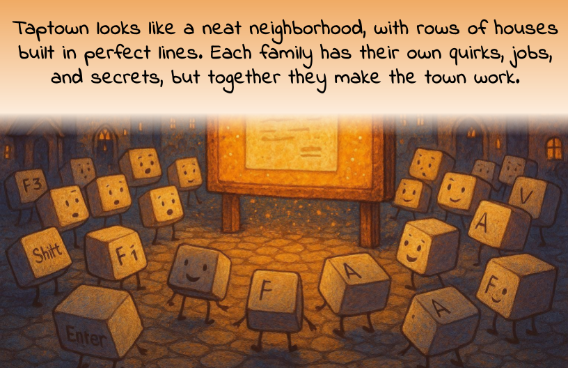

# T.A.P-The-Amazing-Pixels

**A fun and educational children’s storybook that brings the keyboard to life!**

Most of us type on keyboards every day, but have you ever imagined what it would be like if the keys were alive? *TapTown: The Amazing Pixels* is a children’s book that answers that question by turning the keyboard into a colorful town full of quirky characters.

---

## 📖 About the Book

In TapTown, every key has a story:

* **Letters Family (A–Z)** live on Alphabet Lane, always buzzing with spelling contests.
* **Numbers Family (0–9)** keep things running in the Counting Tower.
* **Function Keys (F1–F12)** show off their unique skills up on Function Hill.
* **Mr. Escape**, **Ctrl & Alt**, and even the **Spacebar** each play their part in keeping TapTown alive.

This imaginative setup helps kids connect with technology in a friendly, playful way.

---

## 🎨 Why It’s Special

* **Fun storytelling**: Turns everyday keys into characters kids can relate to.
* **Educational**: Introduces letters, numbers, and computer basics without feeling like a lesson.
* **For ages 5–10**: Perfect for bedtime, classrooms, or tech-curious young readers.

---

## 💡 The Idea Behind TapTown

As kids grow up surrounded by screens, TapTown makes technology less intimidating by showing it as a neighborhood of friendly characters. Each key has a job, a personality, and a secret — just like people in a real town.

---

## 🚀 Get the Book

*TapTown: The Amazing Pixels* is now available on Kindle!

👉 [Read on Kindle](https://www.amazon.com/dp/B0FSQ3FWWR) 

---

## 🔖 How to Support

* ⭐ Star this repo to show support.
* 📢 Share the book with parents, teachers, or anyone teaching kids about technology.
* 📝 Leave a review on Amazon to help more readers discover TapTown.

---

**Next time you press a key, remember — you might just be visiting TapTown.** 🎉

---

© 2025 Hamna Kaleem — All Rights Reserved.
